# NgVendeiFull — Features Documentation

> **Tech Stack:** Angular 21 · Angular Material 21 · Chart.js 4 · Font Awesome · TypeScript 5.9
> **Backend:** [inventory-nod](https://github.com/kapit4n/inventory-nod) (Node.js/Express on port 3000)
> **Database:** PostgreSQL (via backend ORM)

---

## Table of Contents

1. [POS Checkout (Shopping Cart)](#1-pos-checkout-shopping-cart)
2. [Product Catalog (POS Grid)](#2-product-catalog-pos-grid)
3. [Payment Panel](#3-payment-panel)
4. [Ticket Lines (Selected Products)](#4-ticket-lines-selected-products)
5. [POS Invoice Printing](#5-pos-invoice-printing)
6. [Customer Management](#6-customer-management)
7. [Dashboard / Main Hub](#7-dashboard--main-hub)
8. [Product Registration (CRUD)](#8-product-registration-crud)
9. [Product Presentations](#9-product-presentations)
10. [Category Management (CRUD)](#10-category-management-crud)
11. [Units of Measure (CRUD)](#11-units-of-measure-crud)
12. [Inventory Management](#12-inventory-management)
13. [Inventory Lots & Expiry Tracking](#13-inventory-lots--expiry-tracking)
14. [Product Sales Report](#14-product-sales-report)
15. [Sales Analytics Report](#15-sales-analytics-report)
16. [Daily Sales Report](#16-daily-sales-report)
17. [Backend API Browser](#17-backend-api-browser)
18. [Authentication (Login)](#18-authentication-login)
19. [Angular Material Migration History](#19-angular-material-migration-history)

---

## 1. POS Checkout (Shopping Cart)

| Detail | Info |
|---|---|
| **Route** | `/` |
| **Component** | `PosCheckoutComponent` |
| **File** | `src/app/pages/vendei/shopping-cart/pos-checkout.component.ts` |
| **Services** | `VOrdersService`, `VInventoryService`, `VInvoiceService`, `VConfigService` |

### Screenshot
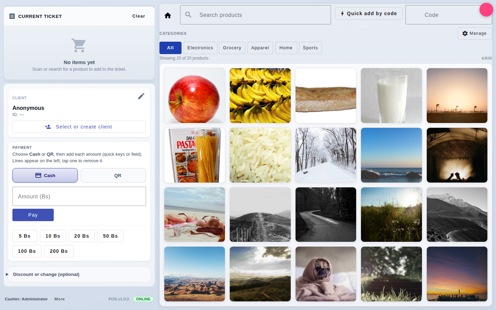

### Git History

| Date | Commit | Description |
|---|---|---|
| 2026-07-01 | `4ad088b` | **feat:** POS invoice print before submit flow with onafterprint fix and error recovery |
| 2026-07-01 | `e169d26` | **perf:** optimize POS checkout, catalog, and inventory services |
| 2026-07-01 | `462afac` | **test:** add comprehensive POS component tests and migrate to waitForAsync |
| 2026-05-04 | `3dc38ba` | Improve POS shopping cart and product catalog UI |
| 2026-04-30 | `339afb8` | **fix(POS):** customer selection CD; inv UI; rep sells quick range |
| 2026-04-24 | `5ebf996` | **feat(app):** POS shell, router fixes, catalog UI, remove duplicate categories |
| 2026-04-16 | `f93a2a7` | **fix(pos):** payment panel, submit rules, and Material disabled binding |
| 2026-04-15 | `62ff1ae` | **fix(POS):** catalog load, cart binding, payment and customers |
| 2026-04-15 | `bb93819` | **feat:** product catalog images, show page, and POS payments |
| 2026-04-14 | `c63b2c4` | Improve vendei POS UI, dev proxy, and full-stack scripts |
| 2020-01-18 | `d7af5d3` | print condition |
| 2018-11-21 | `b7c9692` | Fixed print issues |
| 2018-11-21 | `20aba89` | Recalculate total after edit selected product quantity and add product by code |
| 2018-11-19 | `34fbdc3` | Login to print and save shopping cart |
| 2018-11-18 | `694b996` | Init commit |

### Implementation Details

The POS checkout is the default route (`/`) and serves as the main sales interface. It is composed of:

**Core Features:**
- **Selected products list** — displays cart items with quantity, price, and subtotal
- **Cart summary** — shows total, paid amount, discount, and change to return
- **Payment state** — visual indicator when order is fully paid (`Paid out` badge)
- **Clear / Submit** — clear ticket or submit order buttons, context-aware

**Order Lifecycle (`pos-checkout.component.ts`):**
1. Products are added via `addProduct()` from the catalog (increment quantity if exists, else push new)
2. `recalTotal()` calculates the sum of all line totals with `roundToCents()` precision
3. Payment lines are tracked in three arrays: `payedItems`, `discountItems`, `returnItems`
4. `isOrderReadyToSubmit` checks: total > 0, not in print lock, and `orderAmountDue() <= 0`
5. `submitOrder()` dispatches to one of three strategies:
   - `printInvoiceBeforeSave` → `printInvoiceAndSave()`
   - `printInvoice` with `printTwice` → prints then saves
   - Default → `saveOrder()` directly

**Order Persistence (`saveOrder()`):**
- Builds order + details via `buildOrderAndDetails()`
- POST to `/orders` and `/orderDetails` via `VOrdersService`
- After saving each detail, calls inventory endpoints:
  - `reduceInventory(productId, quantity)`
  - `updateTotalSelled(productId, totalPrice)`
  - `updateQuantitySelled(productId, quantity)`
- On completion, `clearItems()` resets the entire ticket

**Key Architecture Decisions:**
- Uses `concatMap` + `forkJoin` for sequential order creation then parallel detail+inventory updates
- `emptyCustomer` placeholder: `{ id: 1, name: "Anonymous", ci: null, code: null }`
- Print lock (`printOrderCount`) prevents UI interaction during print flow
- Footer shows POS version (`1.0.0`), cashier name, and connection status

---

## 2. Product Catalog (POS Grid)

| Detail | Info |
|---|---|
| **Component** | `PosCatalogComponent` |
| **Feature module** | `src/app/features/vendei/product-list/` |
| **Services** | `VProductsService`, `VCategoriesService`, `VConfigService` |

### Screenshot
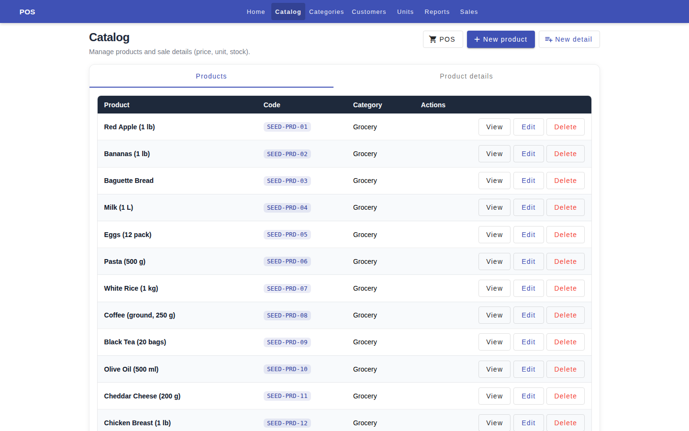

### Git History

| Date | Commit | Description |
|---|---|---|
| 2026-05-04 | `3dc38ba` | Improve POS shopping cart and product catalog UI |
| 2026-04-24 | `57e32e8` | **fix(vendei):** show POS category strip and load categories from API |
| 2026-04-24 | `5ebf996` | **feat(app):** POS shell, router fixes, catalog UI, remove duplicate categories |
| 2026-04-22 | `64efc91` | **feat(demo):** local store catalog images in assets |
| 2026-04-15 | `bb93819` | **feat:** product catalog images, show page, and POS payments |
| 2026-04-15 | `c831805` | **feat(ui):** improve POS product list, cart, and reg catalog |

### Implementation Details

The product catalog is a card-based grid for selecting items to add to the POS cart.

**Key Features:**
- **Product search** — real-time filtering by name or code (via `onSearchChange()`)
- **Category filter chips** — horizontal strip of category buttons above the grid
- **Quick add by code** — type a product code and press Enter to instantly add
- **Product cards** — display image, price, name, and unit label
- **Image resolution** — falls back from presentation image to parent product image to placeholder

**Data Flow:**
- `ngOnInit()` fetches both products and categories via `forkJoin` for atomic loading
- Products are normalized with `currentPrice = roundToCents(p.currentPrice ?? p.price)`
- A sentinel category `{ id: -1, name: "All" }` is prepended for "show all" behavior

**Add to Cart Logic:**
- Finds existing product in cart by id; increments quantity if found, otherwise pushes with quantity=1
- Mutates `this.selectedProducts` array in-place (same reference as parent)

---

## 3. Payment Panel

| Detail | Info |
|---|---|
| **Component** | `PosPaymentPanelComponent` |
| **Feature module** | `src/app/features/vendei/cal-table/` |
| **Utils** | `money.ts` (`roundToCents`, `orderAmountDue`, `isOrderReadyToSubmit`) |
| **Types** | `PaymentType` enum (`PAYMONEY`, `PAYQR`, `DISCOUNT`, `PAYRETURN`) |

### Screenshot
_(See Shopping Cart — payment panel is the bottom section)_

### Git History

| Date | Commit | Description |
|---|---|---|
| 2026-04-16 | `f93a2a7` | **fix(pos):** payment panel, submit rules, and Material disabled binding |
| 2026-04-15 | `bb93819` | **feat:** product catalog images, show page, and POS payments |
| 2026-04-15 | `c831805` | **feat(ui):** improve POS product list, cart, and reg catalog |

### Implementation Details

The payment panel provides a single-lane payment entry system with:

**Payment Methods:**
- **Cash** (`PAYMONEY`) and **QR** (`PAYQR`) — same flow, different tag
- Quick amounts: Bs 5, 10, 20, 50, 100, 200
- Custom amount input with comma-to-dot normalization
- "Pay balance" button to auto-fill the remaining due amount

**Adjustments (collapsible):**
- **Discount** — registered as `DISCOUNT` type, subtracted from total
- **Change/Return** — registered as `PAYRETURN`, returned to customer

**Customer Selection:**
- Opens `CustomersDialogComponent` via Angular Material Dialog
- Displays selected customer ID with fallback `—` for anonymous

**Print Lock:**
- `isPrintLocked` getter prevents interaction while `printOrderCount > 0`
- All payment methods check this before processing

**Key Computations (`money.ts`):**
- `orderAmountDue()`: `max(0, netOrder - effectivePaid)` where `effectivePaid = totalPayed - totalReturn`
- `isOrderReadyToSubmit()`: order total > 0, not locked, and amount due <= 0

---

## 4. Ticket Lines (Selected Products)

| Detail | Info |
|---|---|
| **Component** | `PosTicketLinesComponent` + `PosTicketLineEditDialog` |
| **Feature module** | `src/app/features/vendei/selected-list/` |

### Screenshot
_(See Shopping Cart — ticket lines in the left panel)_

### Git History

| Date | Commit | Description |
|---|---|---|
| 2026-04-15 | `62ff1ae` | **fix(POS):** catalog load, cart binding, payment and customers |

### Implementation Details

Displays the cart items with:
- Product image, name, label (unit info)
- Quantity, unit price, line total
- Click to open edit dialog (quantity and price adjustment)

**Edit Dialog** (`PosTicketLineEditDialog`):
- Modal with quantity and price fields
- On close, updates the product in selectedProducts and recalculates total

---

## 5. POS Invoice Printing

| Detail | Info |
|---|---|
| **Service** | `VInvoiceService` |
| **File** | `src/app/services/vendei/v-invoice.service.ts` |

### Screenshot
_(Thermal-print style invoice generated as HTML)_

### Git History

| Date | Commit | Description |
|---|---|---|
| 2026-07-01 | `4ad088b` | **feat:** POS invoice print before submit flow with onafterprint fix and error recovery |
| 2022-08-23 | `7549ecf` | #53 Move print config to service |
| 2020-01-18 | `d7af5d3` | print condition |
| 2018-11-21 | `20aba89` | Recalculate total after edit... |
| 2018-11-21 | `b7c9692` | Fixed print issues |
| 2018-11-19 | `1b9914a` | Print twice |

### Implementation Details

The invoice printing system generates a full HTML document formatted for 80mm thermal receipt printers.

**Flow (`printInvoiceAndSave`):**
1. Sets `printOrderCount = 1` (locks UI)
2. Generates HTML via `VInvoiceService.generate()` with:
   - Company header ("Codigo Casero" with address)
   - Invoice title, date, time, customer info
   - Product table (qty, description, price, total)
   - Payment breakdown (Cash/QR lines, discount, change)
   - Footer with branding
3. Opens popup window with 400×600 dimensions
4. Calls `printWindow.print()`
5. `onafterprint` handler saves the order and closes popup
6. Fallback: `setInterval` checks if popup was closed manually (every 500ms)

**Print-on-submit modes (config-driven):**
- `config.printInvoiceBeforeSubmit` — print then auto-save
- `config.printInvoice` — print first, requires second click to confirm
- `config.printInvoice` + `printTwice` — two print calls before saving

---

## 6. Customer Management

| Detail | Info |
|---|---|
| **Route** | `/customers` (POS), `/reg/customers` (CRUD) |
| **Components** | `CustomerListComponent`, `CustomersDialogComponent`, `RegCustomerListComponent`, `RegCustomerComponent` |
| **Services** | `VCustomersService`, `RCustomerService` |

### Screenshot
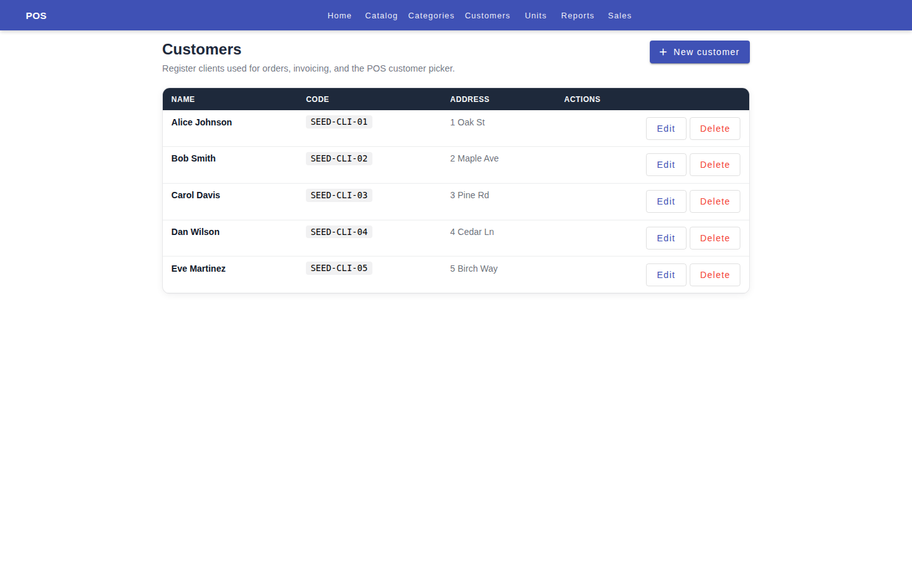

### Git History

| Date | Commit | Description |
|---|---|---|
| 2026-07-01 | `b1548ae` | **fix:** point /customers route to RegCustomerListComponent (working page) |
| 2026-06-30 | `ebd92d1` | **fix:** customers endpoint loading issue |
| 2026-04-30 | `339afb8` | **fix(POS):** customer selection CD; inv UI; rep sells quick range |
| 2022-01-07 | `5a1d03c` | Clients: Integration with API #41 |

### Implementation Details

Two customer management contexts:

**POS Customer Selection:**
- `CustomerListComponent` — inline list with search filter (by name or code/CI)
- `CustomersDialogComponent` — modal dialog for customer lookup during checkout
- Selection triggers `selectCustomer()` callback in the POS parent

**Customer CRUD (`/reg/customers`):**
- List with search, new/edit form via `RegCustomerComponent`
- Full REST integration via `RCustomerService`

---

## 7. Dashboard / Main Hub

| Detail | Info |
|---|---|
| **Route** | `/main` |
| **Component** | `MainComponent` |
| **File** | `src/app/pages/main/main.component.ts` |

### Screenshot
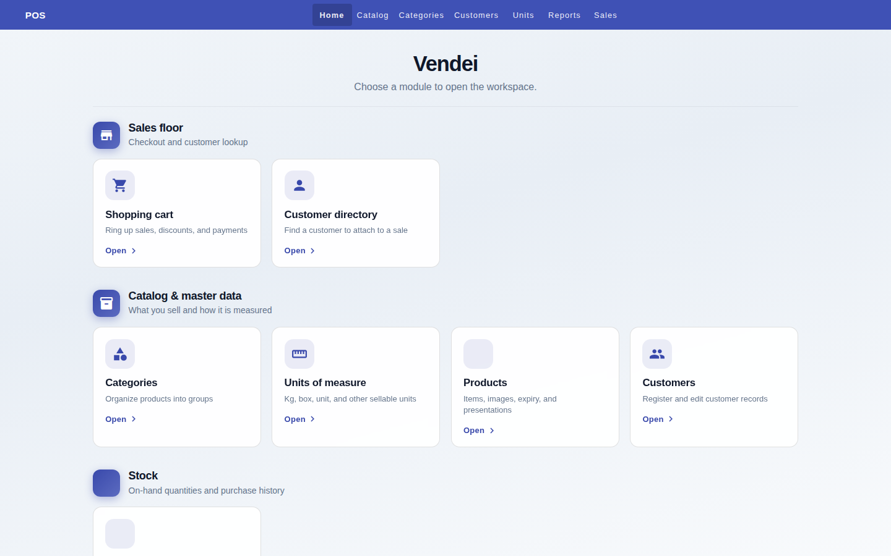

### Git History

| Date | Commit | Description |
|---|---|---|
| 2026-05-04 | `ffe013e` | **feat:** inventory expiry UX, main hub, product sales report, registration |
| 2018-12-28 | `6075527` | Updated main page |
| 2018-12-19 | `8551791` | Updated shopping cart and added main page |

### Implementation Details

The main hub serves as the application navigation dashboard. It uses a tile-based layout organized into sections:

**Navigation Sections:**
| Section | Tiles |
|---|---|
| **Sales Floor** | Shopping Cart, Customer Directory |
| **Catalog & Master Data** | Categories, Units of Measure, Products, Customers |
| **Stock** | Inventory |
| **Reports** | Product Sales, Sales Analytics, Daily Sales |
| **Tools** | Backend API |

Each tile is a Material card with icon, title, description, and "Open" call-to-action linking via `[routerLink]`.

---

## 8. Product Registration (CRUD)

| Detail | Info |
|---|---|
| **Route** | `/reg/products` (list), `/reg/products/new`, `/reg/products/:id`, `/reg/products/view/:id` |
| **Components** | `RegProductListComponent`, `RegProductComponent`, `RegProductShowComponent`, `RegProductQuickEditComponent` |
| **Service** | `RProductService` |

### Screenshot

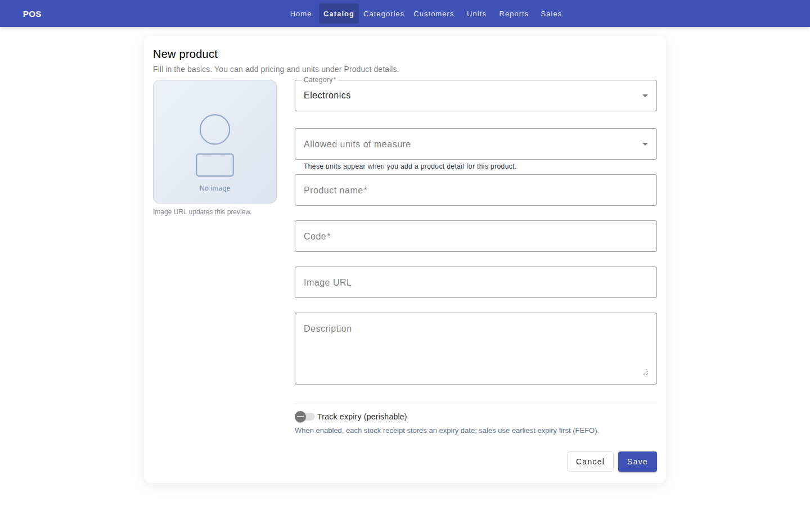

### Git History

| Date | Commit | Description |
|---|---|---|
| 2026-04-24 | `5ebf996` | **feat(app):** POS shell, router fixes, catalog UI, remove duplicate categories |
| 2026-04-16 | `7b269bc` | **fix(reg):** product view, presentations list, and detail edit loading |
| 2026-04-15 | `c831805` | **feat(ui):** improve POS product list, cart, and reg catalog |
| 2022-01-07 | `16366c3` | Product: Integrate register with API #38 |
| 2022-01-07 | `9094da4` | Products: have two tabs for products and its presentation #38 #39 |
| 2022-01-07 | `188a5e7` | Product: Change endpoints to get from presentations |
| 2022-01-06 | `440f264` | Integration: Init |

### Implementation Details

Full CRUD for products with:

**Product List (`RegProductListComponent`):**
- Two-tab layout: Products tab and Product Details (presentations) tab
- Loads both products and presentations on init
- Actions: New Product, New Product Presentation, Edit, View, Delete
- Shows unit of measure label per presentation

**Product Form (`RegProductComponent`):**
- Create and edit modes
- Fields for name, code, description, price, category, unit of measure, image
- Validates and submits via `RProductService`

**Product View (`RegProductShowComponent`):**
- Read-only detail view with product information and presentations

---

## 9. Product Presentations

| Detail | Info |
|---|---|
| **Route** | `/reg/productPresentations/new`, `/reg/productPresentations/:id` |
| **Component** | `RegProductPresentationComponent` |
| **Service** | `RProductPresentationService` |

### Screenshot
_(See Product List — second tab)_

### Git History

| Date | Commit | Description |
|---|---|---|
| 2026-04-16 | `7b269bc` | **fix(reg):** product view, presentations list, and detail edit loading |
| 2022-01-07 | `c63861b` | ProductPresentation: Integrate with API #39 |
| 2022-01-07 | `9094da4` | Products: have two tabs for products and its presentation #38 #39 |

### Implementation Details

Product presentations are variations or packaging options for a base product (e.g., "1 kg bag", "box of 12"). They extend the product model with:

- Different unit of measure
- Specific price and code
- Custom image per presentation
- Managed via `RProductPresentationService` (full CRUD)

---

## 10. Category Management (CRUD)

| Detail | Info |
|---|---|
| **Route** | `/reg/categories` (list), `/reg/categories/new`, `/reg/categories/:id` |
| **Components** | `RegCategoryListComponent`, `RegCategoryComponent` |
| **Service** | `RCategoryService` |

### Screenshot
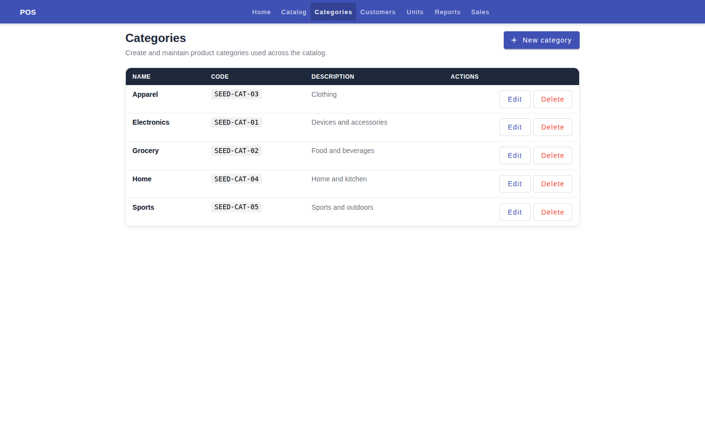

### Git History

| Date | Commit | Description |
|---|---|---|
| 2026-04-24 | `585f9f7` | **feat(reg):** category CRUD pages (list, new, edit, delete) |
| 2022-01-07 | `3714eb6` | Category: Integration with API #40 |
| 2022-01-06 | `f5b8dd1` | Adding category list component |

### Implementation Details

Categories are used to organize products. Features:

- **List** — sorted alphabetically, with delete confirmation dialog
- **Create/Edit** — form component with name, code, description
- **Delete guards** — warns if category may be in use by products
- API integration via `RCategoryService`

---

## 11. Units of Measure (CRUD)

| Detail | Info |
|---|---|
| **Route** | `/reg/unit-of-measures` (list), `/reg/unit-of-measures/:id` |
| **Components** | `RegUnitOfMeasureListComponent`, `RegUnitOfMeasureComponent` |
| **Service** | `RUnitOfMeasureService` |

### Screenshot
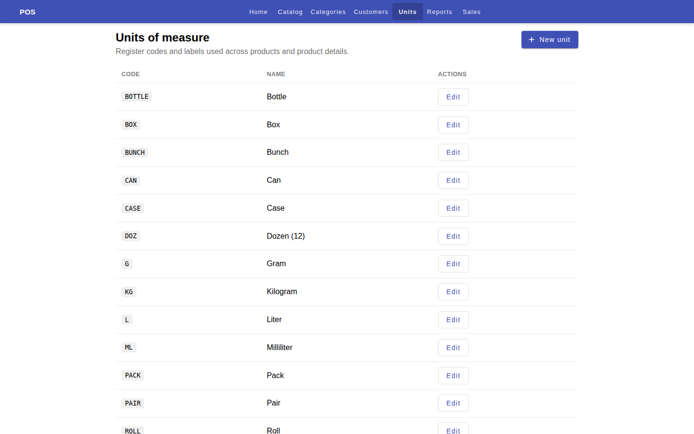

### Git History

| Date | Commitment | Description |
|---|---|---|
| 2026-04-24 | `5852062` | **feat(reg):** units of measure UI and product UOM workflow |

### Implementation Details

Units of measure define sellable quantities (kg, unit, box, etc.):

- **List** — all available UOMs
- **Create/Edit** — form with name, code, description
- Used by product presentations for pricing and inventory tracking

---

## 12. Inventory Management

| Detail | Info |
|---|---|
| **Route** | `/inv/products` (list), `/inv/products/:id` (detail) |
| **Components** | `InvProductsComponent`, `InvProductsInvComponent` |
| **Services** | `IProductsService`, `IConfigService` |

### Screenshot
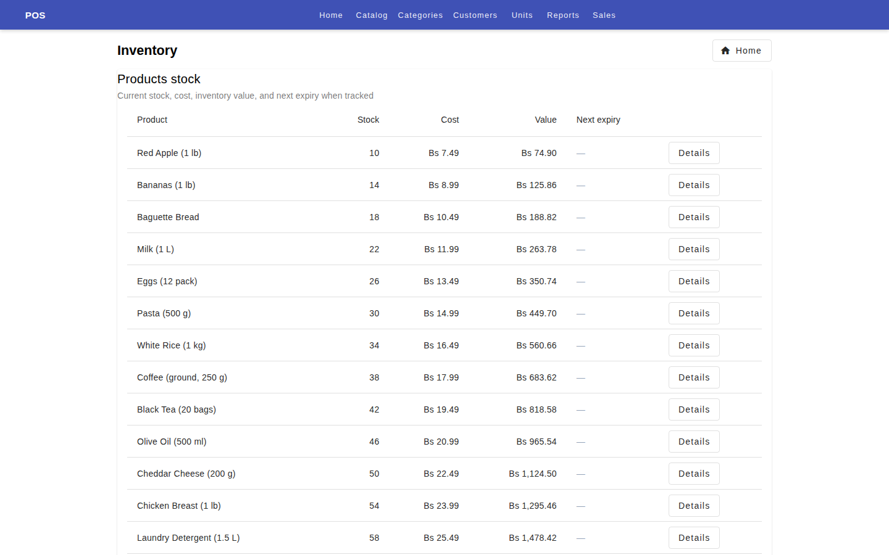
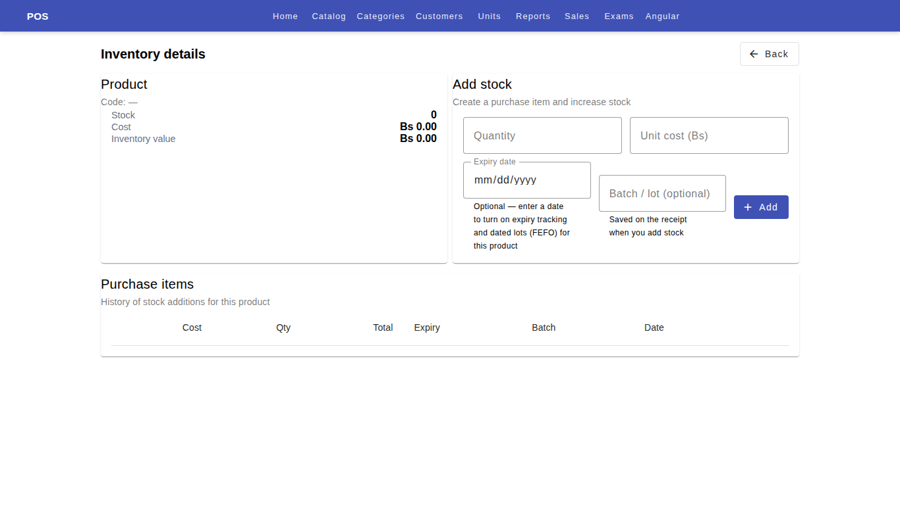
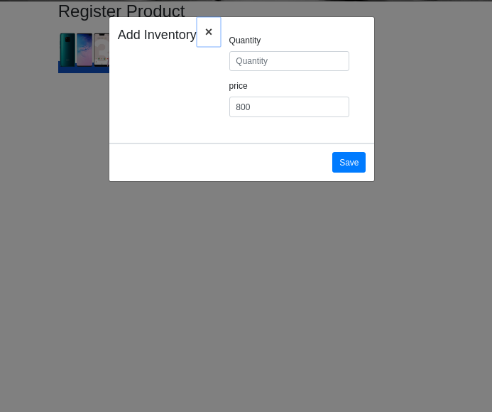

### Git History

| Date | Commit | Description |
|---|---|---|
| 2026-07-01 | `44ab17a` | **fix:** align inventory endpoints with backend GET routes, fix productId fallback chain |
| 2026-07-01 | `e169d26` | **perf:** optimize POS checkout, catalog, and inventory services |
| 2026-04-30 | `339afb8` | **fix(POS):** customer selection CD; inv UI; rep sells quick range |
| 2026-04-24 | `ffe013e` | **feat:** inventory expiry UX, main hub, product sales report, registration |
| 2018-11-21 | `434e73c` | Moved remoteBill and addBill functions to shopping cart comp |

### Implementation Details

Inventory management tracks stock levels and product quantities.

**Inventory List (`InvProductsComponent`):**
- Fetches all products with `includeLots: true` for lot-level visibility
- Displays stock quantities, prices, and expiry information
- Links to per-product inventory detail

**Inventory Detail (`InvProductsInvComponent`):**
- Line items for each inventory lot/transaction
- Add stock functionality via form
- Updates to inventory are triggered from POS order submission

**Inventory Integration:**
- On POS order save, three inventory updates per detail:
  - `reduceInventory(productId, quantity)` — decrement stock
  - `updateTotalSelled(productId, totalPrice)` — track revenue
  - `updateQuantitySelled(productId, quantity)` — track units sold

---

## 13. Inventory Lots & Expiry Tracking

| Detail | Info |
|---|---|
| **Util files** | `src/app/utils/inv-expiry.ts` |

### Screenshot
_(Part of inventory management UI)_

### Git History

| Date | Commit | Description |
|---|---|---|
| 2026-05-04 | `ffe013e` | **feat:** inventory expiry UX, main hub, product sales report, registration |

### Implementation Details

For perishable products (`trackExpiry = true`), the system tracks:

- **Lots** — inventory lots with expiry dates
- **Earliest expiry** — `earliestOpenLotExpiry()` finds the soonest-expiring open lot
- **Days from today** — `daysFromTodayUtc()` calculates remaining days
- **Visual indicators**:
  - `expiry-row--past` (expired, red) for negative days
  - `expiry-row--soon` (within 7 days, warning) for imminent expiry
  - Normal class for future expiry

**Expiry hints** displayed in inventory list:
- "today", "1 day", "N days", or "-Nd" (past expiry)

---

## 14. Product Sales Report

| Detail | Info |
|---|---|
| **Route** | `/rep/products` |
| **Component** | `RepProductsComponent` |
| **Service** | `RepProductsService` |
| **Utils** | `rep-product-sales-analytics.ts` |

### Screenshot
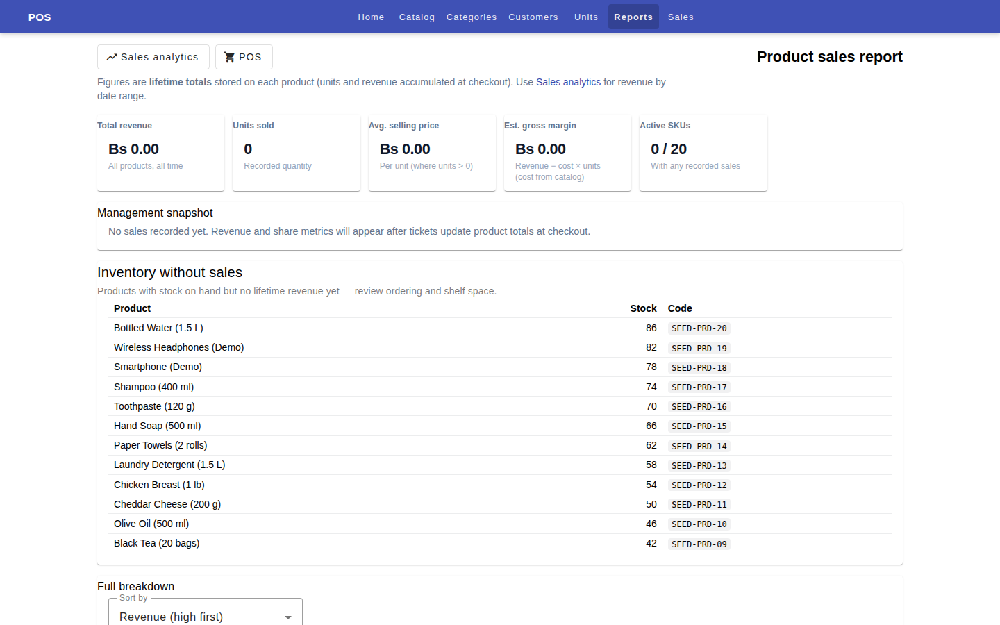

### Git History

| Date | Commit | Description |
|---|---|---|
| 2026-05-04 | `ffe013e` | **feat:** inventory expiry UX, main hub, product sales report, registration |
| 2018-11-21 | `2d86355` | Sell reports and product reports |

### Implementation Details

Detailed product performance analytics:

**Executive Summary:**
- Total products, total units sold, total revenue
- Top product (highest revenue)
- Revenue share of top 5 products

**Analytics Table (sortable):**
| Column | Description |
|---|---|
| Rank | Revenue ranking |
| Name | Product name |
| Code | Product code |
| Units | Total units sold |
| Revenue | Total revenue (Bs) |
| Share | % of total revenue |
| Avg Price | Average selling price |
| Est. Margin | Estimated profit margin |
| Stock | Current stock level |

**Slow Movers:**
- Identifies products with low sales volume (configurable threshold)
- Helps identify underperforming inventory

**Top Products Chart:**
- Horizontal bar chart (Chart.js) showing top 10 revenue-generating products
- Revenue in Bolivianos (Bs)

---

## 15. Sales Analytics Report

| Detail | Info |
|---|---|
| **Route** | `/rep/sells` |
| **Component** | `RepSellsComponent` |
| **Service** | `RepSellsService` |
| **Utils** | `rep-sell-analytics.ts` |

### Screenshot
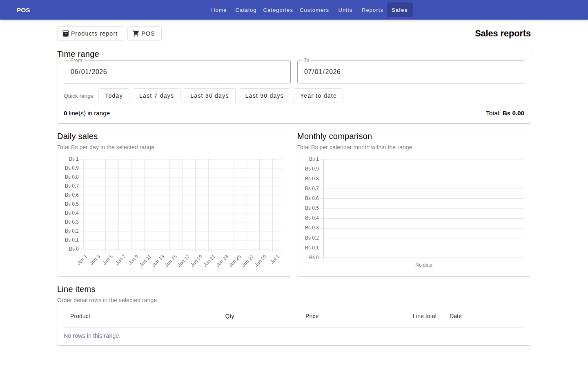

### Git History

| Date | Commit | Description |
|---|---|---|
| 2026-04-30 | `339afb8` | **fix(POS):** customer selection CD; inv UI; rep sells quick range |
| 2026-04-29 | `72ba7af` | sell chart impl |
| 2018-11-21 | `2d86355` | Sell reports and product reports |

### Implementation Details

Comprehensive sales analytics with:

**Date Range Filters:**
- Quick presets: Today, Last 7 days, 30 days, 90 days, Year to Date
- Custom date picker with From/To inputs
- Client-side filtering from full data set

**Data Display:**
- Filtered sales table with columns: product, quantity, price, totalPrice, createdDate
- Total revenue and line count for current range

**Charts (Chart.js):**
- **Daily bar chart** — revenue per day in the selected range
  - Responsive with auto-skip ticks, max 18 labels
  - Tooltip shows `Bs X.XX`
- **Monthly bar chart** — revenue aggregated by month
  - Color-coded (blue for daily, pink for monthly)

**Analytics Utilities (`rep-sell-analytics.ts`):**
- `buildDailySeries()` — aggregates sells into daily buckets
- `buildMonthlySeries()` — aggregates into monthly buckets  
- `filterSellsByDateRange()` — date range filtering
- `sumSellTotals()` — sum of all sell totals
- `parseInputDateValue()` / `toInputDateValue()` — date serialization

---

## 16. Daily Sales Report

| Detail | Info |
|---|---|
| **Route** | `/rep/daily-sales` |
| **Component** | `RepDailySalesComponent` |
| **Service** | `RepDailySalesService` |

### Screenshot
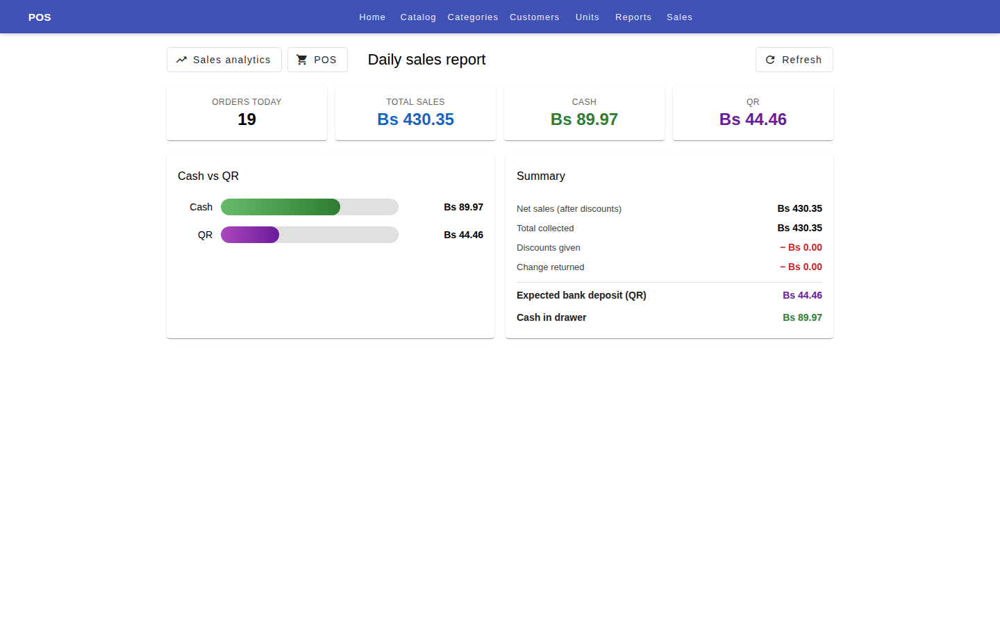

### Git History

| Date | Commit | Description |
|---|---|---|
| 2026-07-01 | `a84635f` | **feat:** daily sales report with cash vs QR breakdown and payment persistence |

### Implementation Details

Real-time daily sales summary showing:

**Summary Metrics:**
| Field | Description |
|---|---|
| `orderCount` | Number of orders today |
| `totalSales` | Gross sales total |
| `totalCash` | Total cash payments |
| `totalQr` | Total QR payments |
| `totalDiscount` | Total discounts applied |
| `totalReturn` | Total change/returns |
| `netCash` | Cash minus returns (computed) |
| `netTotal` | Sales minus discounts (computed) |

**Payment Method Breakdown:**
- Cash percentage vs QR percentage
- Doughnut/bar visualization (via `chartLabels` / `chartValues` getters)

**API Endpoint:**
- `GET /orders/today-summary` returns `DailySalesSummary` DTO

---

## 17. Backend API Browser

| Detail | Info |
|---|---|
| **Route** | `/tools/backend-api` |
| **Component** | `BackendApiPageComponent` |
| **Service** | `BackendApiCatalogService` |

### Screenshot
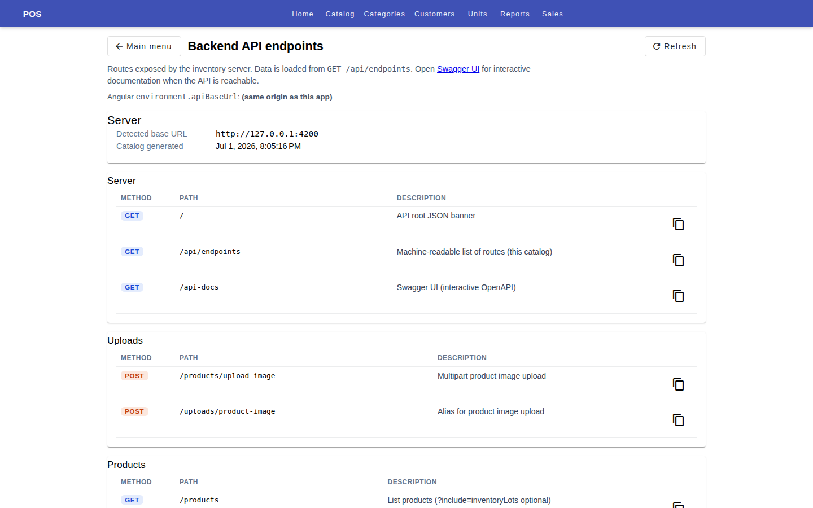

### Git History

| Date | Commit | Description |
|---|---|---|
| 2026-07-01 | `93e3325` | **feat:** add database model introspection view to backend API page |
| 2026-05-04 | `d5f6d8b` | **feat:** backend API catalog page, shell scroll fix, dev proxy |

### Implementation Details

Developer diagnostic tool for exploring the backend API:

**Catalog View:**
- Lists all API endpoint groups with their routes and methods
- Shows server URL and effective API root
- Links to Swagger docs (`/api-docs`)

**Database Model Introspection:**
- Fetches database model definitions from backend
- Expandable model detail view
- Shows column names, types, and relationships

**Data Sources:**
- `getCatalog()` — API endpoint listing
- `getModels()` — database model definitions
- Uses `forkJoin` for parallel loading

---

## 18. Authentication (Login)

| Detail | Info |
|---|---|
| **Component** | `LoginComponent` |
| **Module** | `src/app/components/auth/login/` |

### Screenshot
_(In-app — basic login form)_

### Git History

| Date | Commit | Description |
|---|---|---|
| 2018-11-19 | `34fbdc3` | Login to print and save shopping cart |

### Implementation Details

Basic login component included in the app shell:

- Standard username/password form using Angular Material
- Styled with Material form fields and buttons
- Integrates with the backend authentication flow

---

## 19. Angular Material Migration History

The project has undergone multiple Angular + Material upgrades:

| Date | Commit | Description |
|---|---|---|
| 2026-04-15 | `6abe7bc` | **chore:** upgrade Angular 15 → 21 |
| 2023-09-26 | `f6b8163` | Move to material 15 |
| 2023-09-26 | `eae85ec` | Move to angular material 14 |
| 2023-09-26 | `c45d218` | Move angular material to 13 |
| 2023-09-26 | `9a1ccf4` | Move to material 12 |
| 2023-09-26 | `74c24e4` | Move angular material to 11 |
| 2023-09-26 | `1b094bf` | Upgrade to angular material 10 |
| 2023-09-26 | `5588005` | Upgrade angular material |
| 2023-09-26 | `91041bf` | Upgrade to 15 |
| 2023-09-26 | `137fe6c` | Remove bootstrap |
| 2019-06-05 | `8e2e4bb` | Upgrade to angular 8 |

Current version: **Angular 21** with **Material 21** (2026).

---

## Appendix: Project Structure

```
src/app/
├── app.module.ts              # Root module (281 lines, all routes + providers)
├── app.component.ts           # Route-aware shell (isPosShell detection)
├── components/auth/login/     # Login component
├── features/vendei/           # POS feature components
│   ├── product-list/          # Product catalog grid
│   ├── selected-list/         # Ticket lines + edit dialog
│   ├── cal-table/             # Payment panel
│   ├── customer-list/         # POS customer list
│   └── customers-dialog/      # Customer selection dialog
├── pages/                     # Route-level pages
│   ├── main/                  # Dashboard hub
│   ├── vendei/                # POS checkout, page-not-found, screenshots
│   ├── reg/                   # Registration modules (11 subdirs)
│   ├── inv/                   # Inventory (2 subdirs)
│   ├── rep/                   # Reports (6 subdirs)
│   └── tools/                 # Backend API browser
├── services/                  # HTTP/data services
│   ├── vendei/                # POS services (7 files)
│   ├── reg/                   # Registration services (8 files)
│   ├── inv/                   # Inventory services (3 files)
│   ├── rep/                   # Reports services (4 files)
│   └── tools/                 # Backend API catalog service
└── utils/                     # Shared helpers
    ├── money.ts               # Currency rounding, order readiness
    ├── inv-expiry.ts          # Expiry date calculations
    ├── api-body.ts            # API response normalization
    ├── product-display-text.ts # Product name formatting
    ├── product-image-url.ts   # Image URL fallback logic
    ├── reg-catalog-entities.ts
    ├── rep-product-sales-analytics.ts
    └── rep-sell-analytics.ts
```

---

*Last updated: 2026-07-01*
*Document generated from codebase analysis and git history*
